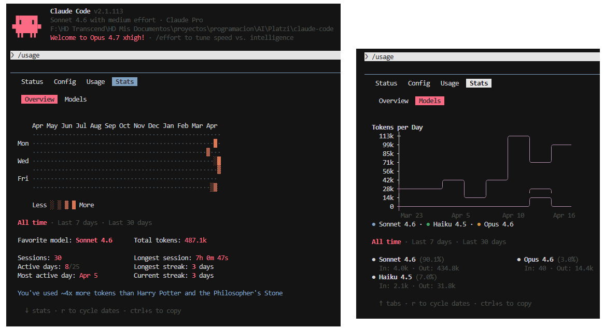

# 👋 Welcome! I'm Francisco Alejandro Retamal Reinoso

**Information Technology Engineer | Thinking about what comes next — BCI, nanotech, AI**

---

I hold a five-year *Ingeniero Civil Informático* degree (Information Technology Engineering) — internationally recognized as between a Bachelor's and a Master's level per ZAB assessment. During my program I also completed all but one course of the Master's in Engineering Sciences track; I chose to redirect again toward the Startup School specialization instead of the common path of the majority, the "Capstone project", as I did when I chose the Master's track. The academic depth of that near-Master's path remains part of what I bring — it's a distinction I keep visible: it matters in contexts where academic depth is weighed seriously, including future doctoral or research paths.

Self-taught long before university, curious by nature, I started long before any formal program to build intuition for how technologies connect and compound, quick to pick up any technology I need. And that has told me the relevant thing isn't the next job, it's the next decade of technology. I've been writing code since well before university, and I'm looking for my first professional role not to clock in, but to focus that direction and build seriously. Based in Chile, open to relocation.

---

## Technical Skills *(pre-LLM era, before 2022)*

- **Main:** HTML, CSS, Python
- **Also worked with:** JavaScript, jQuery, PHP, SQL, C, C++, R, Linux, Laravel, VBA for Excel, AutoHotkey, MQL4, Basic for Atari

---

## Interests

- **Software Engineering** — building clean, efficient, and maintainable systems
- **Brain-Computer Interfaces** — the intersection of computing and the human brain
- **Nanotechnology** — emerging tech at the smallest scale

---

## Currently

- 🎓 Recently graduated (2025)
- 🔍 Open to work — seeking opportunities in software development
- 📚 Always learning the next tool I need
- **Actively learning:** Claude Code (2026) and LLM models development

*Screenshot taken on April 17, 2026.*

---

> [!IMPORTANT]
> Watch me code! Visit my [YouTube playlist here](https://www.youtube.com/playlist?list=PLLWpzRBlOIXRjvo-WCCYsJjXrnmcfHNSJ).
>
> ❗ **My programming and 'engineering' experience prior to academia (5-year program, internationally recognized as between a Bachelor's and a Master's level per ZAB assessment) is much broader than what this GitHub shows.**

---

*Feel free to reach out*
- 💼 [LinkedIn](https://github.com/AlejandroPu)
*Open to opportunities, collaborations, or just talk tech!*
